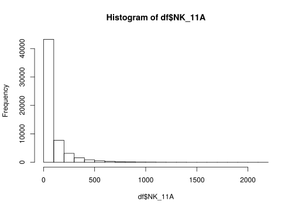
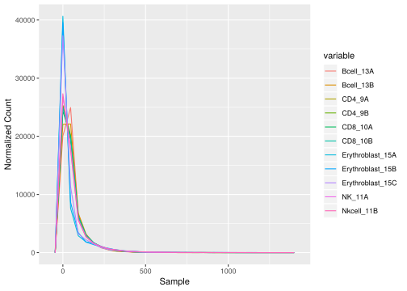
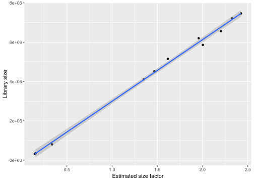
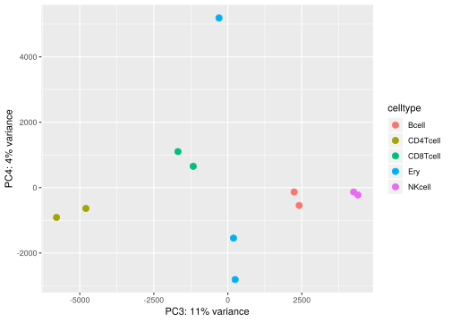
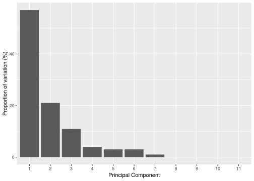
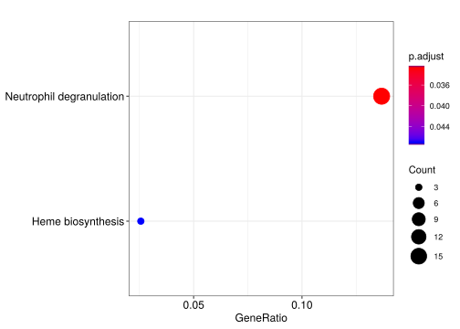
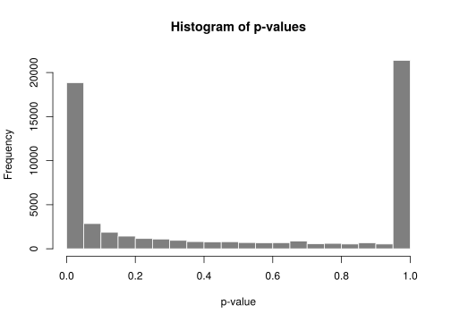

---
output:
  html_document:
    fig_width: 10
---

# ATAC-Seq Data Analysis

## Methods

In this tutorial we will explore methods for measuring the central value:

* [Mean](https://en.wikipedia.org/wiki/Mean)
* [Median](https://en.wikipedia.org/wiki/Median)

Methods for measuring the variance or dispersion of the data:

* [Standard Deviation](https://en.wikipedia.org/wiki/Standard_deviation)
* [Range](https://en.wikipedia.org/wiki/Range_(statistics))
* [Quartiles](https://en.wikipedia.org/wiki/Quartile)
* [Inter Quartile Range (IQR)](https://en.wikipedia.org/wiki/Interquartile_range)

Methods for data exploration and visualization:

* [Principal component analysis](https://en.wikipedia.org/wiki/Principal_component_analysis)
* [Box plots](https://en.wikipedia.org/wiki/Box_plot)
* [Histogram](https://en.wikipedia.org/wiki/Histogram)

Methods for genomic count data normalization and differential peak calling:

* [Data transformation](https://en.wikipedia.org/wiki/Data_transformation_(statistics))
* [Variance stabilizing transformation](https://en.wikipedia.org/wiki/Variance-stabilizing_transformation)
* [DESeq2](https://bioconductor.org/packages/release/bioc/html/DESeq2.html)

Methods for gene set and pathway enrichment and visualizing differential peak calling results:

* [Heat map](https://en.wikipedia.org/wiki/Heat_map)
* [Gene set enrichment analysis](https://en.wikipedia.org/wiki/Gene_set_enrichment_analysis)
* [Pathway analysis](https://en.wikipedia.org/wiki/Pathway_analysis)


## R libraries

We need a couple of libraries for the exercises. Let's load them all upfront:


```r
library(ggplot2)
library(reshape2)
library(pander)
library(Hmisc)
library(pastecs)
library(DESeq2)
library(ChIPseeker)
library(TxDb.Hsapiens.UCSC.hg19.knownGene)
library(clusterProfiler)
library(org.Hs.eg.db)
library(ReactomePA)
library(pheatmap)
```


## Load the ATAC-Seq count matrix

Let's load the count matrix and the sample information with the blood type and donor.


```r
df = read.table("atac.data.gz", header=T)
si = read.table("blood.samples", header=F)
colnames(si) = c("sample", "celltype", "donor")
rownames(si) = si$sample
si$donor = factor(si$donor)
pander(dim(df), "Data dimensions")
```

_590650_ and _14_

```r
pander(head(df))
```


----------------------------------------------------------------
 Chr    Start     End     Bcell_13A   CD4_9A   CD4_9B   CD8_10B 
------ -------- -------- ----------- -------- -------- ---------
 chr1   10025    10525        0         0        2         0    

 chr1   13252    13752        0         4        0         2    

 chr1   16019    16519        1         0        2         0    

 chr1   96376    96876        0         0        0         0    

 chr1   115440   115940       0         2        0         0    

 chr1   235393   235893       2         4        2         0    
----------------------------------------------------------------

Table: Table continues below

 
------------------------------------------------------------------------------
 Erythroblast_15A   Erythroblast_15B   Erythroblast_15C   NK_11A   Nkcell_11B 
------------------ ------------------ ------------------ -------- ------------
        0                  0                  0             3          2      

        0                  0                  0             2          0      

        2                  0                  0             2          2      

        0                  0                  0             0          0      

        4                  2                  0             0          0      

        0                  0                  0             2          4      
------------------------------------------------------------------------------

Table: Table continues below

 
---------------------
 Bcell_13B   CD8_10A 
----------- ---------
     0          0    

     0          0    

     0          2    

     0          0    

     0          0    

     0          0    
---------------------

```r
pander(head(si))
```


----------------------------------------------
    &nbsp;        sample     celltype   donor 
--------------- ----------- ---------- -------
 **Bcell_13A**   Bcell_13A    Bcell     5483  

 **Bcell_13B**   Bcell_13B    Bcell     5483  

  **CD4_9A**      CD4_9A     CD4Tcell   5483  

  **CD4_9B**      CD4_9B     CD4Tcell   5483  

  **CD8_10A**     CD8_10A    CD8Tcell   5483  

  **CD8_10B**     CD8_10B    CD8Tcell   5483  
----------------------------------------------

```r
print(summary(si))
```

```
##        sample      celltype  donor   
##  Bcell_13A:1   Bcell   :2   5483:11  
##  Bcell_13B:1   CD4Tcell:2            
##  CD4_9A   :1   CD8Tcell:2            
##  CD4_9B   :1   Ery     :3            
##  CD8_10A  :1   NKcell  :2            
##  CD8_10B  :1                         
##  (Other)  :5
```

## Removing missing peaks

The original count matrix had many more samples and thus, we have now a number of peaks in our matrix that are actually not present anymore.
Let's remove all the rows where not a single sample has more than 50 reads.


```r
df = df[apply(df[,4:ncol(df)], 1, max) > 50,]
pander(dim(df), "Data dimensions")
```

_57891_ and _14_

```r
cm = df[,4:ncol(df)]
pander(quantile(rowSums(cm)))
```


------------------------------
 0%   25%   50%   75%   100%  
---- ----- ----- ----- -------
 71   260   444   944   16021 
------------------------------

```r
pander(quantile(rowMeans(cm)))
```


--------------------------------------
  0%      25%     50%     75%    100% 
------- ------- ------- ------- ------
 6.455   23.64   40.36   85.82   1456 
--------------------------------------

```r
pander(quantile(apply(cm, 1, max)))
```


-----------------------------
 0%   25%   50%   75%   100% 
---- ----- ----- ----- ------
 51   71    111   209   2471 
-----------------------------

## Data Exploration

With the cleaned data, we can of course now compute simple statistics for each sample like the mean read count and standard deviation of counts across peaks. Box plots are useful for summarizing the distribution of read counts.


```r
print(mean(df$NK_11A))
```

```
## [1] 89.05225
```

```r
print(sd(df$NK_11A))
```

```
## [1] 138.2255
```

```r
sim = rnorm(1000, mean=100, sd=10)
boxplot(sim)
```


```r
hist(sim)
```


```r
pander(quantile(sim))
```


---------------------------------------
  0%      25%     50%     75%    100%  
------- ------- ------- ------- -------
 68.79   92.95   99.63   106.3   134.2 
---------------------------------------

```r
boxplot(df$NK_11A)
```


```r
hist(df$NK_11A)
```



```r
pander(quantile(df$NK_11A))
```


-----------------------------
 0%   25%   50%   75%   100% 
---- ----- ----- ----- ------
 0    12    43    102   2184 
-----------------------------

A common technique for labelling outliers uses the 25% and 75% quantiles.


```r
pw = df$NK_11A
uq = quantile(pw, 0.75)
print(mean(pw > 1.5 * uq))
```

```
## [1] 0.1635487
```

```r
iqr = IQR(pw)
print(mean(pw > 3 * iqr))
```

```
## [1] 0.07711043
```


We obviously have a very skewed distribution with a long tail. This is very common in Genomics and the standard approach to account for such a skewed distribution is some kind of log-transformation of the count data.


```r
pw = log(df$NK_11A + 1)
boxplot(pw)
```


```r
hist(pw)
```


The other major problem in genomic count data sets is that they often show [heteroscedasticity](https://en.wikipedia.org/wiki/Heteroscedasticity) which means in our case that different peaks show different levels of variabilities in the number of reads. This is a major problem for differential peak calling.


```r
rowsummary = data.frame(rowmeans = apply(df[, 4:ncol(df)], 1, mean), rowsds = apply(df[, 4:ncol(df)], 1, sd))
ggplot(data=rowsummary, aes(x=rowmeans, y=rowsds)) + geom_point() + xlab("Peak means") + ylab("Peak SDs")
```


## Data normalization 

Extensions of the simple log-transformation such as rlog or the [variance stabilizing transformation](https://en.wikipedia.org/wiki/Variance-stabilizing_transformation) have been developed and are often applied to count data sets. [DESeq2](https://bioconductor.org/packages/release/bioc/html/DESeq2.html) also provides a method to compute normalized counts that account for library size and variance-mean dependencies.


```r
counts = df[,4:ncol(df)]
dds = DESeqDataSetFromMatrix(countData = counts[,order(colnames(counts))], colData = si, design = ~ celltype)
dds = DESeq(dds)
cm = data.frame(counts(dds, normalized=TRUE))
rownames(cm) = paste0(df$Chr, '_', df$Start, '_', df$End)
```

## Data visualization

Let's explore the normalized counts.


```r
lf = melt(cm, id.vars=c())
pander(head(lf))
```


-------------------
 variable    value 
----------- -------
 Bcell_13A   120.3 

 Bcell_13A   28.59 

 Bcell_13A   36.76 

 Bcell_13A   36.31 

 Bcell_13A   24.51 

 Bcell_13A   41.3  
-------------------

```r
ggplot(data=lf, aes(x=variable, y=value)) + geom_boxplot(aes(group=variable)) + xlab("Sample") + ylab("Normalized Count") + coord_flip()
```


```r
ggplot(data=lf, aes(x=value)) + geom_freqpoly(aes(group=variable, color=variable), bins=30) + xlab("Sample") + ylab("Normalized Count")
```



```r
libsize = data.frame(x=sizeFactors(dds), y=colSums(assay(dds)))
ggplot(data=libsize, aes(x=x, y=y)) + geom_point() + geom_smooth(method="lm") + xlab("Estimated size factor") + ylab("Library size")
```




## Principal component analysis (PCA)

Let's do a PCA on the normalized counts and project the cell-type information onto the PCA plot.


```r
pca = prcomp(t(cm))
print(summary(pca))
```

```
## Importance of components:
##                              PC1       PC2       PC3       PC4       PC5
## Standard deviation     7401.6259 4460.2806 3302.6565 2.011e+03 1.698e+03
## Proportion of Variance    0.5654    0.2053    0.1126 4.175e-02 2.977e-02
## Cumulative Proportion     0.5654    0.7708    0.8833 9.251e-01 9.549e-01
##                              PC6       PC7       PC8       PC9      PC10
## Standard deviation     1.602e+03 837.51387 638.98215 610.83234 567.93309
## Proportion of Variance 2.649e-02   0.00724   0.00421   0.00385   0.00333
## Cumulative Proportion  9.814e-01   0.98861   0.99282   0.99667   1.00000
##                             PC11
## Standard deviation     2.079e-11
## Proportion of Variance 0.000e+00
## Cumulative Proportion  1.000e+00
```

```r
pcaData = as.data.frame(pca$x)
pcaData$sample=rownames(pcaData)
pcaData=merge(pcaData, si)
percentVar = round(100 * (pca$sdev^2 / sum( pca$sdev^2 ) ))
p=ggplot(data=pcaData, aes(x = PC1, y = PC2, color=celltype)) + geom_point(size=3)
p=p+xlab(paste0("PC1: ", percentVar[1], "% variance"))
p=p+ylab(paste0("PC2: ", percentVar[2], "% variance"))
print(p)
```


```r
q=ggplot(data=pcaData, aes(x = PC3, y = PC4, color=celltype)) + geom_point(size=3)
q=q+xlab(paste0("PC3: ", percentVar[3], "% variance"))
q=q+ylab(paste0("PC4: ", percentVar[4], "% variance"))
print(q)
```



We can also check the proportion of variance explained by each PC.


```r
varexp = data.frame(x=1:length(percentVar), y=percentVar)
varexp$x = factor(varexp$x)
ggplot(data=varexp, aes(x=x, y=y)) + geom_bar(stat="identity") + xlab("Principal Component") + ylab("Proportion of variation (%)")
```



Lastly we can inspect the loadings for each PC. That is we can investigate which peaks contribute most to the separation of the individual cell types.


```r
loadings = abs(pca$rotation)
contribution = as.data.frame(sweep(loadings, 2, colSums(loadings), "/"))
contribution = contribution[with(contribution, order(-PC1)),]
pander(head(contribution))
```


------------------------------------------------------------------------------
            &nbsp;                 PC1         PC2         PC3         PC4    
------------------------------ ----------- ----------- ----------- -----------
 **chr12_92987578_92988078**    0.0004424   0.0001124   1.766e-05   7.004e-05 

 **chr1_224691015_224691515**   0.0003718   0.0001519   3.07e-05    0.0002056 

  **chr8_38795902_38796402**    0.0003584   0.0003164   0.0001248   5.385e-05 

 **chr12_92270808_92271308**    0.0003584   0.0002103   5.986e-05   9.303e-06 

 **chr12_51295467_51295967**    0.0003429   0.0001555   8.909e-06   9.567e-06 

 **chr15_74902825_74903325**    0.0003399   0.0001579   9.641e-06   3.776e-06 
------------------------------------------------------------------------------

Table: Table continues below

 
------------------------------------------------------------------------------
            &nbsp;                 PC5         PC6         PC7         PC8    
------------------------------ ----------- ----------- ----------- -----------
 **chr12_92987578_92988078**    1.955e-05   5.95e-05    4.679e-05   0.0001663 

 **chr1_224691015_224691515**   6.718e-05   0.0001275   1.757e-05   2.673e-05 

  **chr8_38795902_38796402**    0.0001721   6.097e-05   6.327e-05   0.000128  

 **chr12_92270808_92271308**    3.164e-05   4.929e-05   0.0001448   0.0001997 

 **chr12_51295467_51295967**    6.043e-06   0.0001456   8.594e-07   1.615e-05 

 **chr15_74902825_74903325**    2.996e-05   0.0003589   3.861e-05   7.074e-06 
------------------------------------------------------------------------------

Table: Table continues below

 
------------------------------------------------------------------
            &nbsp;                 PC9        PC10        PC11    
------------------------------ ----------- ----------- -----------
 **chr12_92987578_92988078**    0.0002022   5.283e-06   0.0001728 

 **chr1_224691015_224691515**   6.669e-06   3.329e-06   0.0001102 

  **chr8_38795902_38796402**    1.797e-05   0.0001382   4.786e-05 

 **chr12_92270808_92271308**    7.393e-05   6.688e-05   0.0001987 

 **chr12_51295467_51295967**    1.024e-05   4.807e-07   3.969e-05 

 **chr15_74902825_74903325**    4.397e-06   4.686e-06   0.0001824 
------------------------------------------------------------------


## Annotate genomic context

Let's annotate the genomic context of each peak such as nearby genes a given peak may regulate.


```r
gr = makeGRangesFromDataFrame(df, keep.extra.columns=T)
peakAnno = annotatePeak(gr, tssRegion=c(-1000, 1000), TxDb=TxDb.Hsapiens.UCSC.hg19.knownGene, annoDb="org.Hs.eg.db")
```

```
## >> preparing features information...		 2019-05-05 02:13:04 PM 
## >> identifying nearest features...		 2019-05-05 02:13:04 PM 
## >> calculating distance from peak to TSS...	 2019-05-05 02:13:05 PM 
## >> assigning genomic annotation...		 2019-05-05 02:13:05 PM 
## >> adding gene annotation...			 2019-05-05 02:13:16 PM 
## >> assigning chromosome lengths			 2019-05-05 02:13:17 PM 
## >> done...					 2019-05-05 02:13:17 PM
```

The genomic context of all peaks can be ploted using:


```r
plotAnnoPie(peakAnno)
```


Let's have a look at the 500 peaks with the highest loading for PC1. Looking at the PCA plot PC1 seems to separate Erythroid cells from the others.


```r
dfPA = as.data.frame(peakAnno)
rownames(dfPA) = paste0(dfPA$seqnames, '_', dfPA$start, '_', dfPA$end)
selpeaks = dfPA[rownames(head(contribution, 500)),]
pathway1 = enrichPathway(selpeaks[abs(selpeaks$distance) < 5000,]$geneId)
pander(head(pathway1))
```


--------------------------------------------------------------------------
      &nbsp;              ID               Description          GeneRatio 
------------------- --------------- -------------------------- -----------
 **R-HSA-6798695**   R-HSA-6798695   Neutrophil degranulation    16/117   

 **R-HSA-189451**    R-HSA-189451       Heme biosynthesis         3/117   
--------------------------------------------------------------------------

Table: Table continues below

 
----------------------------------------------------------------
      &nbsp;          BgRatio     pvalue     p.adjust   qvalue  
------------------- ----------- ----------- ---------- ---------
 **R-HSA-6798695**   480/10619   6.996e-05   0.03267    0.03267 

 **R-HSA-189451**    11/10619    0.0002017   0.04709    0.04709 
----------------------------------------------------------------

Table: Table continues below

 
--------------------------------------------------------------------------------------------------------
      &nbsp;                                               geneID                                       
------------------- ------------------------------------------------------------------------------------
 **R-HSA-6798695**   210/8694/10383/847/5553/54472/23197/3043/3071/5870/272/353189/8621/2992/4033/51646 

 **R-HSA-189451**                                      210/3145/2235                                    
--------------------------------------------------------------------------------------------------------

Table: Table continues below

 
---------------------------
      &nbsp;         Count 
------------------- -------
 **R-HSA-6798695**    16   

 **R-HSA-189451**      3   
---------------------------

```r
dotplot(pathway1)
```

```
## wrong orderBy parameter; set to default `orderBy = "x"`
```



Heme metabolism is important during erythropoiesis and the neutrophil degranulation pathway is important for cells of the immune system. Hence, it makes sense that these peaks separate the Erythroid cells from the white blood cells.


## Differential peak calling

We can also identify differential peaks between two cell types using DESeq2.


```r
res = results(dds, lfcThreshold=1, contrast=c("celltype", "Bcell", "Ery"))
print(mcols(res, use.names=T))
```

```
## DataFrame with 6 rows and 2 columns
##                        type                                   description
##                 <character>                                   <character>
## baseMean       intermediate     mean of normalized counts for all samples
## log2FoldChange      results log2 fold change (MLE): celltype Bcell vs Ery
## lfcSE               results         standard error: celltype Bcell vs Ery
## stat                results         Wald statistic: celltype Bcell vs Ery
## pvalue              results      Wald test p-value: celltype Bcell vs Ery
## padj                results                          BH adjusted p-values
```

```r
print(summary(res))
```

```
## 
## out of 57891 with nonzero total read count
## adjusted p-value < 0.1
## LFC > 1.00 (up)    : 14782, 26%
## LFC < -1.00 (down) : 2132, 3.7%
## outliers [1]       : 0, 0%
## low counts [2]     : 0, 0%
## (mean count < 3)
## [1] see 'cooksCutoff' argument of ?results
## [2] see 'independentFiltering' argument of ?results
## 
## NULL
```

The histogram of p-values is


```r
hist(res$pvalue, breaks=0:20/20, col="grey50", border="white", xlim=c(0,1), main="Histogram of p-values", xlab="p-value")
```



The log-fold changes can be visualized using


```r
plotMA(res, ylim = c(-5, 5))
```


Let's plot the significant results in a heatmap:


```r
print(sum(res$padj < 0.01 & abs(res$log2FoldChange) > 1))
```

```
## [1] 9105
```

```r
mat = cm[which(res$padj < 0.01 & abs(res$log2FoldChange) > 1),]
mat = mat - rowMeans(mat)
anno = as.data.frame(colData(dds)[, c("sample", "celltype")])
rownames(mat) = NULL
pheatmap(mat, annotation_col = anno, scale="row")
```


For the up- and down-regulated peaks we can again perform pathway enrichment. Please note that up-regulated peaks are higher in B cells whereas down-regulated peaks are higher in Erythroid cells given our contrast of B-cells vs. Erythroid cells.


```r
selpeaks = dfPA[rownames(cm[which(res$padj < 0.1 & res$log2FoldChange>0),]),]
pathwayUp = enrichPathway(selpeaks[abs(selpeaks$distance) < 5000,]$geneId)
pander(head(pathwayUp))
```


--------------------------------------------------------------------------------
      &nbsp;              ID                  Description             GeneRatio 
------------------- --------------- -------------------------------- -----------
 **R-HSA-194840**    R-HSA-194840           Rho GTPase cycle           59/1664  

 **R-HSA-983695**    R-HSA-983695       Antigen activates B Cell       22/1664  
                                       Receptor (BCR) leading to                
                                          generation of second                  
                                               messengers                       

 **R-HSA-2029480**   R-HSA-2029480      Fcgamma receptor (FCGR)        39/1664  
                                         dependent phagocytosis                 

 **R-HSA-4420097**   R-HSA-4420097        VEGFA-VEGFR2 Pathway         41/1664  

 **R-HSA-449147**    R-HSA-449147      Signaling by Interleukins      122/1664  

 **R-HSA-9006934**   R-HSA-9006934   Signaling by Receptor Tyrosine   120/1664  
                                                Kinases                         
--------------------------------------------------------------------------------

Table: Table continues below

 
-------------------------------------------------------------------
      &nbsp;          BgRatio     pvalue     p.adjust     qvalue   
------------------- ----------- ----------- ----------- -----------
 **R-HSA-194840**    138/10619   2.048e-14   2.737e-11   2.367e-11 

 **R-HSA-983695**    32/10619    2.261e-11   1.51e-08    1.306e-08 

 **R-HSA-2029480**   86/10619    6.262e-11   2.789e-08   2.413e-08 

 **R-HSA-4420097**   99/10619    6.401e-10   2.138e-07   1.85e-07  

 **R-HSA-449147**    463/10619   1.123e-09   3.001e-07   2.596e-07 

 **R-HSA-9006934**   458/10619   2.24e-09    4.698e-07   4.065e-07 
-------------------------------------------------------------------

Table: Table continues below

 
----------------------------------------------------------------------------------------------------------------------------------------------------------------------------------------------------------------------------------------------------------------------------------------------------------------------------------------------------------------------------------------------------------------------------------------------------------------------------------------------------------------------------------------------------------------------------------------------------------------------------------------------------------------------
      &nbsp;                                                                                                                                                                                                                                                                                                                              geneID                                                                                                                                                                                                                                                                                                                      
------------------- --------------------------------------------------------------------------------------------------------------------------------------------------------------------------------------------------------------------------------------------------------------------------------------------------------------------------------------------------------------------------------------------------------------------------------------------------------------------------------------------------------------------------------------------------------------------------------------------------------------------------------------------------
 **R-HSA-194840**                                                                                                                                                            55160/998/10451/389/9181/257106/2665/94134/9886/391/143872/57569/397/121512/54509/90627/8874/23263/394/11214/29/201176/396/23526/7409/23370/4650/51291/64857/9138/388/6654/23433/9938/55843/57580/613/5880/9901/50650/57514/8997/26084/116984/399/83478/10144/79658/7204/23092/221472/117289/5879/23221/84904/89846/7410/395/393                                                                                                                                                         

 **R-HSA-983695**                                                                                                                                                                                                                                                                     5293/29760/118788/6786/5777/3709/801/5336/974/7409/933/973/6654/3708/4690/27071/5295/2534/80228/640/4067/6850                                                                                                                                                                                                                                                                   

 **R-HSA-2029480**                                                                                                                                                                                                                       998/10163/2268/10451/3709/3071/122618/4644/5336/4641/71/7525/7409/4650/5581/10097/10096/7456/10109/3055/63916/5594/3708/5580/4690/5290/5295/26999/2534/60/5879/9844/3984/10095/4067/5747/6850/7410/7454                                                                                                                                                                                                                      

 **R-HSA-4420097**                                                                                                                                                                                                                    5590/998/10163/5567/10451/117145/9047/4688/9261/3845/3709/3071/5829/801/5579/1535/71/6093/7409/208/8440/3685/63916/4689/3708/5580/4690/5290/253260/5295/26999/2534/60/5879/9844/857/2185/5747/79109/7410/1536                                                                                                                                                                                                                   

 **R-HSA-449147**       5293/998/163702/6195/5724/3932/3725/1901/1435/3570/5451/356/9261/3586/29949/7431/6935/3688/3185/240/29760/9049/9846/3587/7132/5777/51561/11213/1848/2322/3146/2308/3936/4792/57161/2353/302/4088/3603/4205/3566/50615/246778/3684/3687/3965/6352/6348/6351/5608/9021/7525/5771/596/7409/2208/3383/9466/3718/3594/2323/5443/6654/57162/3557/26469/6775/2335/3667/3055/351/6647/3588/3689/6285/23765/5594/4282/5008/3162/3568/729230/1234/941/942/3592/5290/604/5602/4790/3558/2247/3600/3575/5295/4208/84868/23291/8878/3662/1026/5292/6885/2309/2534/53832/6196/7291/3569/5898/5478/2185/1846/4067/3574/4609/4507/6850/2889/6197/4478/3561    

 **R-HSA-9006934**   5590/998/6195/10163/3932/5567/10451/117145/9047/26052/3915/4688/127124/9261/3688/3185/143282/10312/9846/80310/5777/5800/3845/3709/3071/1848/3479/10019/5829/2254/2322/8874/801/161742/6692/5607/1445/4205/5579/57610/1535/84951/3675/71/7525/5771/6093/3909/7409/208/2323/29924/6654/5581/200734/8440/26469/10254/2591/3685/8828/2335/3667/1286/1285/23767/83737/63916/1299/5753/6285/5594/135/4689/9402/3708/5580/26018/4690/5290/2247/2549/253260/55914/5295/4208/2241/9542/1729/5159/26999/2534/5796/2099/6196/60/5879/9844/5898/64759/10603/857/673/26281/2185/1846/2260/4067/55824/54845/5440/5747/5774/9550/79109/2889/5900/7410/6197/1536 
----------------------------------------------------------------------------------------------------------------------------------------------------------------------------------------------------------------------------------------------------------------------------------------------------------------------------------------------------------------------------------------------------------------------------------------------------------------------------------------------------------------------------------------------------------------------------------------------------------------------------------------------------------------------

Table: Table continues below

 
---------------------------
      &nbsp;         Count 
------------------- -------
 **R-HSA-194840**     59   

 **R-HSA-983695**     22   

 **R-HSA-2029480**    39   

 **R-HSA-4420097**    41   

 **R-HSA-449147**     122  

 **R-HSA-9006934**    120  
---------------------------

```r
selpeaks = dfPA[rownames(cm[which(res$padj < 0.1 & res$log2FoldChange<0),]),]
pathwayDown = enrichPathway(selpeaks[abs(selpeaks$distance) < 5000,]$geneId)
pander(head(pathwayDown))
```


----------------------------------------------------------------------------
      &nbsp;             ID           Description      GeneRatio   BgRatio  
------------------ -------------- ------------------- ----------- ----------
 **R-HSA-189451**   R-HSA-189451   Heme biosynthesis     5/437     11/10619 
----------------------------------------------------------------------------

Table: Table continues below

 
-----------------------------------------------------------------------------
      &nbsp;         pvalue     p.adjust   qvalue            geneID          
------------------ ----------- ---------- --------- -------------------------
 **R-HSA-189451**   4.339e-05   0.04538    0.04476   7389/7390/3145/2235/210 
-----------------------------------------------------------------------------

Table: Table continues below

 
--------------------------
      &nbsp;        Count 
------------------ -------
 **R-HSA-189451**     5   
--------------------------

There are many other methods for functional enrichments such as [GREAT](http://great.stanford.edu/) or [DAVID](https://david.ncifcrf.gov/).
This concludes the ATAC-Seq tutorial. I hope you enjoyed it.
